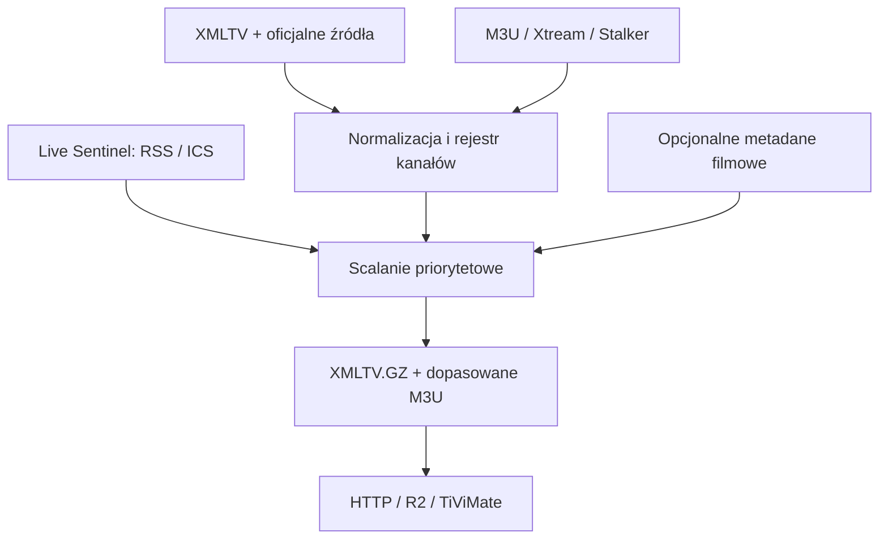

# KR Live EPG

Samodzielny generator XMLTV dla polskich kanałów, zaprojektowany przede wszystkim
pod TiViMate i listy, w których nazwy są zaśmiecone oznaczeniami operatora. Łączy
wiele źródeł EPG, zachowuje najbogatsze metadane, wykrywa pilne komunikaty o
transmisjach i generuje dopasowaną listę M3U oraz XMLTV pod konkretny TV box.

Projekt obsługuje:

- zwykłe M3U/M3U8;
- Xtream Codes (`player_api.php`);
- katalog kanałów Stalker/MAG (portal + MAC), bez kopiowania strumieni;
- XMLTV i skompresowane XMLTV.GZ jako źródła ramówki;
- RSS, Atom i iCalendar jako źródła szybkich korekt „Live Sentinel”;
- klasyfikację jakości, która usuwa reklamy źródła udające audycje;
- opcjonalne metadane filmowe TMDb;
- historię ramówki, znaczniki `catch-up`, premierę, nowość i powtórkę;
- lokalnie buforowane logotypy kanałów ze stabilnym URL-em;
- lokalny dysk albo zgodny z S3 magazyn obiektowy, w tym Cloudflare R2;
- stałe URL-e HTTP, GitHub Pages za 0 zł, Docker, cron/systemd i Cloud Run.

## Co ten system rozwiązuje

Nazwa dostawcy taka jak:

```text
[PL] | Polsat Sport 1 FHD 50FPS HEVC
```

jest mapowana na:

```text
Polsat Sport 1   ->   polsat-sport-1.pl
```

Usuwane są oznaczenia jakości, kodeka, kraju i pakietu (`HD`, `FHD`, `4K`,
`HEVC`, `50FPS`, `[PL]`, `VIP`). System nie usuwa słów, które są częścią
tożsamości kanału (`Sport`, `Premium`, `Extra`, `Film`) i nie pomyli numerów,
np. `Polsat Sport 1` z `Polsat Sport 2`.



## Ważne, uczciwe ograniczenia

Nie istnieje jedno darmowe, legalne i kompletne źródło, które gwarantuje na żywo
program każdej polskiej stacji, PPV i kanału VOD. Generator jest tak dobry, jak
podłączone źródła. Kod daje warstwę agregacji i automatycznej korekty, ale nie
„zgaduje” transmisji bez dowodu.

Live Sentinel akceptuje korektę, gdy pochodzi z jednego źródła oznaczonego jako
oficjalne albo gdy potwierdzą ją dwa niezależne źródła. Dzięki temu przypadkowy
wpis w portalu nie zastąpi prawidłowej ramówki. Reguła z priorytetem 1000 usuwa
kolidujący stary wpis (np. kabaret) wyłącznie w czasie nowej transmisji.

TiViMate pobiera EPG okresowo. Serwer nie może sam „wcisnąć” aktualizacji do
aplikacji. Nawet jeśli plik zmieni się minutę po komunikacie nadawcy, TV box pokaże
zmianę po następnym odświeżeniu przez aplikację. Oficjalne dekodery operatorów
zwykle nie pozwalają podmienić ich EPG.

Stalker nie daje standardowego pliku M3U do przepisania. Generator tworzy więc w
XMLTV zarówno kanoniczne nazwy, jak i nazwy/identyfikatory widziane w portalu.
TiViMate zazwyczaj może po nich dopasować kanały, ale konkretny portal i wersję
aplikacji trzeba sprawdzić na urządzeniu.

## Szybki start — Linux

Wymagany jest Python 3.12 lub nowszy.

```bash
cp .env.example .env
chmod 600 .env
./scripts/install.sh
```

Następnie edytuj `config.yaml`, uzupełnij zmienne w `.env` i wykonaj:

```bash
set -a
. ./.env
set +a
.venv/bin/kr-live-epg build --config config.yaml
```

Wyniki pojawią się w:

```text
output/dom/epg.xml
output/dom/epg.xml.gz
output/dom/playlist.m3u     # dla M3U i Xtream
output/dom/status.json
output/dom/coverage.json   # kanały pełne, zastępcze i faktycznie puste
output/lekki/epg.xml.gz   # krótszy zakres dla słabszych TV boxów
```

Kontrola wyniku:

```bash
.venv/bin/kr-live-epg validate output/dom/epg.xml.gz
.venv/bin/kr-live-epg normalize "PL | Polsat Sport 1 FHD [HEVC]"
```

## Konfiguracja wejścia

### M3U

```yaml
profiles:
  dom:
    playlist:
      type: m3u
      source_id: operator-dom
      url: ${IPTV_M3U_URL}
```

Można użyć `path: /bezpieczna/sciezka/lista.m3u` zamiast `url`. Wygenerowaną
`playlist.m3u` należy dodać do TiViMate jako nową listę. Ma ona te same adresy
strumieni, lecz prawidłowe `tvg-id` i czyste nazwy. To właśnie eliminuje ręczne
łączenie 200–300 kanałów.

### Xtream Codes

```yaml
profiles:
  dom:
    playlist:
      type: xtream
      source_id: operator-dom
      base_url: ${XTREAM_BASE_URL}
      username: ${XTREAM_USERNAME}
      password: ${XTREAM_PASSWORD}
      output: ts
```

Generator pobiera katalog `get_live_streams` i tworzy dopasowane M3U. Plik
zawiera URL-e z loginem i hasłem, dlatego musi być chroniony tokenem i nie może
trafić do publicznego repozytorium.

### Stalker / MAG

```yaml
profiles:
  salon:
    playlist:
      type: stalker
      source_id: portal-salon
      portal_url: ${STALKER_PORTAL_URL}
      mac: ${STALKER_MAC}
      serial: ${STALKER_SERIAL:-}
```

Adapter próbuje typowych endpointów `portal.php` i `server/load.php`, wykonuje
handshake, a następnie pobiera wyłącznie katalog kanałów. Nie generuje linków do
strumieni Stalker. Używaj go tylko z portalem, do którego masz legalny dostęp.

W TiViMate zachowujesz istniejący portal Stalker i dodajesz URL
`epg.xml.gz` jako zewnętrzne źródło EPG. W XML znajdują się surowe nazwy kanałów
portalu jako aliasy, więc aplikacja ma szansę dopasować je bez ręcznej pracy.

## Źródła ramówki

Każde źródło ma priorytet. Wyższa liczba wygrywa w konflikcie, a brakujące opisy,
obsada i oceny są uzupełniane z pozostałych źródeł.

```yaml
guide_sources:
  - id: glowne
    type: xmltv
    url: https://domena.example/guide.xml.gz
    priority: 80
    trusted: true
  - id: uzupelniajace
    type: xmltv
    url: https://inna.example/guide.xml
    priority: 40
```

`config.example.yaml` łączy aktualne pliki `epg.ovh/plar.gz` (dłuższy zakres)
oraz `epg.ovh/pltv.gz` (bogatsze pola) jako łatwy przykład techniczny.
Przed użyciem, a szczególnie przed odpłatnym udostępnianiem wyniku, trzeba
sprawdzić aktualny regulamin i uzyskać prawa do redystrybucji. To samo dotyczy
każdego agregatora, logo, opisu i recenzji.

Po udanym pobraniu zapisywana jest ostatnia poprawna kopia źródła. Chwilowa awaria
serwisu nie zeruje więc EPG. W `status.json` pojawia się ostrzeżenie o użyciu
cache.

Generator odrzuca techniczne reklamy udające audycje, np. „Brak źródła. EPG
dostarcza serwis…”. Uczciwe komunikaty kanału eventowego są oznaczane jako
zastępcze i zawsze przegrywają konflikt z prawdziwą transmisją. `coverage.json`
podaje osobno kanały z realną ramówką, wyłącznie z wpisem zastępczym oraz puste.

## Live Sentinel — nagłe transmisje

Sentinel czyta otwarte RSS/Atom/ICS. Reguła wskazuje wzorzec komunikatu i kanały,
które trzeba poprawić. Tekst musi podać godzinę; obsługiwane są także `dzisiaj`,
`jutro` i daty `DD.MM.RRRR` oraz `RRRR-MM-DD`.

```yaml
sentinel:
  enabled: true
  near_window_hours: 36
  feeds:
    - id: nadawca-oficjalny
      url: https://nadawca.example/aktualnosci.rss
      type: rss
      official: true
  rules:
    - id: siatkowka-final
      pattern: '(?P<title>finał.*siatk(?:ówki|owki))'
      channel_ids: [polsat.pl, polsat-sport-1.pl]
      required_terms: [transmisja]
      default_duration_minutes: 180
      min_confidence: 0.86
```

Jeśli wpis brzmi na przykład „Finał siatkówki — transmisja dzisiaj o 20:30”,
powstaje pozycja live na obu wskazanych kanałach. Nieoficjalny feed sam nie
przekracza domyślnego progu; potrzebne jest drugie niezależne potwierdzenie.

Automatyczne skrobanie dowolnych stron nie jest włączone. Każda witryna ma inną
strukturę, zabezpieczenia i warunki użycia. Bezpieczniej dodać kontrolowany feed
lub osobny adapter do źródła, na które jest zgoda.

Dla prostej, dozwolonej strony eventowej można użyć adaptera HTML z XPath:

```yaml
feeds:
  - id: strona-eventow
    url: https://organizator.example/wydarzenia
    type: html
    official: true
    item_xpath: //article
    title_xpath: .//h2//text()
    body_xpath: .//text()
    link_xpath: .//a/@href
```

Pobieranie ma limity rozmiaru, nie uruchamia JavaScriptu i nie obchodzi blokad
witryny. Należy respektować regulamin, `robots.txt` i rozsądny interwał zapytań.
Konfiguracja GitHub Pages zawiera gotowy, konserwatywny adapter oficjalnego
kalendarza KSW. Dodaje galę do `ksw.pl` wraz z adresem dowodu, ale celowo nie
zgaduje, który anonimowy numer `PPV Event Fight` wybrał dany operator.

## Pełne opisy filmów, seriali i programów

XMLTV zachowuje, jeśli źródło je dostarczy:

- tytuł i podtytuł, fabułę, kategorię i kraj;
- tytuł oryginalny, rok i kraje produkcji, studio/producenta oraz czas trwania;
- numer odcinka, reżyserów, producentów, aktorów, scenarzystów, prowadzących i komentatorów;
- kategorię wiekową, ocenę, recenzję, ikonę oraz link;
- oznaczenie premiery, nowego odcinka, powtórki i transmisji na żywo.

Opcjonalne TMDb uzupełnia brakującą fabułę, rok, kraje, studio, gatunki, obsadę,
reżysera, plakat i ocenę filmów oraz bezpiecznie dopasowanych seriali/programów:

```yaml
tmdb:
  enabled: true
  api_token: ${TMDB_API_TOKEN}
  language: pl-PL
  region: PL
  cache_days: 90
  max_requests_per_run: 80
```

Wyniki są cache’owane w SQLite. Dopasowanie jest konserwatywne: tytuł po
normalizacji musi być zgodny, aby obcy film nie dostał niewłaściwej obsady.
Najważniejsze fakty są również dopisywane do widocznego opisu, bo nie każda
wersja aplikacji pokazuje wszystkie osobne pola XMLTV.
Przed komercyjnym wdrożeniem trzeba użyć planu/licencji API dopuszczających taki
model oraz spełnić wymogi atrybucji. Tekst cudzej recenzji jest przepisywany tylko
wtedy, gdy legalne źródło XMLTV już go zawiera.

## Zakres czasu, catch-up i logo

Profil `dom` zachowuje 7 dni wstecz i do 14 dni naprzód. Profil `lekki` zachowuje
2 dni wstecz i do 7 dni naprzód. Są to maksymalne okna generatora; jeśli źródło
opublikuje tylko 7 dni przyszłej ramówki, brakujących siedmiu dni nie wolno
zgadywać.

Historyczny wpis XMLTV pokazuje, co było emitowane. Odtworzenie audycji wymaga
archiwum operatora. Przy przetwarzaniu M3U generator zachowuje znaczniki
`catchup`, `catchup-source`, `catchup-days`, `timeshift` i `tvg-shift`, dlatego
nie usuwa mechanizmu cofania dostarczonego przez operatora.

Logo ma następującą kolejność: rejestr/źródło EPG, a jeśli go brakuje — M3U lub
katalog Stalker. Przy ustawionym `storage.public_base_url` bezpieczne rastrowe
PNG/JPG/GIF/WebP są kopiowane obok EPG i odświeżane domyślnie co 30 dni. XMLTV
oraz znormalizowane M3U wskazują wtedy stabilny adres tej kopii.

## Uruchomienie bezobsługowe

### Docker Compose

```bash
cp config.example.yaml config.yaml
cp .env.example .env
docker compose up -d --build
```

Kontener `scheduler` robi pełny przebieg co 10 minut, a `epg` serwuje pliki na
porcie 8080. Pierwszy przebieg zaczyna się od razu.

### Cron

```cron
*/10 * * * * cd /opt/kr-live-epg && ./scripts/run-locked.sh live >> state/cron.log 2>&1
```

`flock` zapobiega nałożeniu dwóch przebiegów.

### systemd

Pliki w `deploy/systemd/` zawierają usługę HTTP oraz timer co 10 minut. Po
skopiowaniu ich do `/etc/systemd/system/`:

```bash
sudo systemctl daemon-reload
sudo systemctl enable --now kr-live-epg.service kr-live-epg-build.timer
```

## Stały URL dla TiViMate

### Wariant 0 zł — używany w pilotażu

Publiczne repozytorium wydawnicze uruchamia standardowy GitHub Actions raz na
godzinę, pobiera kod z prywatnego repozytorium tylko do odczytu i publikuje
artefakt GitHub Pages. Kod, token TMDb i ewentualne dane portalu pozostają
sekretami; publiczne są tylko pliki EPG. Instrukcja i gotowy workflow znajdują
się w `deploy/github-pages/README.md`.

W Pages publikowana jest tylko skompresowana wersja `.xml.gz`; pominięcie
kilkusetmegabajtowej kopii nieskompresowanej skraca wdrożenie i nie zmienia
działania TiViMate.

Adresy mają postać:

```text
https://LOGIN.github.io/kr-epg-guide/v1/dom/epg.xml.gz
https://LOGIN.github.io/kr-epg-guide/v1/lekki/epg.xml.gz
```

Nieudany przebieg nie zastępuje ostatniej poprawnej wersji. Harmonogram działa
o 17 minut po pełnej godzinie, aby ograniczyć typowe opóźnienia zadań ustawionych
dokładnie na `:00`.

### Wariant własnego serwera

Lokalny serwis udostępnia:

```text
http://SERWER:8080/v1/dom/epg.xml.gz?token=TAJNY_TOKEN
http://SERWER:8080/v1/dom/playlist.m3u?token=TAJNY_TOKEN
http://SERWER:8080/v1/dom/status.json?token=TAJNY_TOKEN
http://SERWER:8080/v1/dom/coverage.json?token=TAJNY_TOKEN
```

Token pochodzi z `profiles.dom.delivery_token`. Jeśli pole jest puste, pliki są
publiczne. Dla dostępu spoza domu należy postawić HTTPS (reverse proxy albo
tunel), nie wystawiać surowego portu HTTP do internetu.

Opcjonalny wariant chmurowy rozdziela generowanie od dostarczania:

1. Cloud Run uruchamia generator na żądanie harmonogramu.
2. Generator atomowo wysyła pliki do prywatnego R2 przez API S3.
3. Mały Cloudflare Worker zwraca plik pod stałym URL-em z tokenem w ścieżce.

Kod Workera znajduje się w `deploy/cloudflare-worker/`, a instrukcja Cloud Run w
`deploy/google-cloud/`. Ustaw `storage.public_base_url` na pełną bazę Workera,
np. `https://epg.example/v1/TAJNY_TOKEN`; wtedy wygenerowane M3U samo wskazuje
właściwe EPG.

Ten wariant nie jest używany przy wymaganiu bezwzględnego kosztu 0 zł: Cloud Run
i podobne usługi mogą wymagać konta rozliczeniowego, a ich darmowy limit nie jest
twardą blokadą kosztów.

## API administracyjne

Ręczne lub harmonogramowe uruchomienie:

```bash
curl -X POST \
  -H "X-Admin-Token: $KR_EPG_ADMIN_TOKEN" \
  "https://generator.example/admin/run?mode=live"
```

Żądanie kończy się dopiero po zapisaniu i publikacji plików. Endpointy
`/healthz` i `/readyz` służą do monitoringu. Token administratora musi być inny
niż token dostępu do EPG.

## Rebranding i nowe kanały

Rejestr startowy znajduje się w
`src/kr_live_epg/resources/channels_pl.yaml`. Nieznany kanał z legalnego źródła
XMLTV jest dodawany dynamicznie, a decyzja dla konkretnego identyfikatora
operatora trafia do SQLite. Przy następnych przebiegach system najpierw sprawdza
aktualną nazwę, a później bezpieczną zapamiętaną relację.

Własny rejestr może deklarować dawne identyfikatory:

```yaml
channels:
  - id: nowa-marka.pl
    name: Nowa Marka
    aliases: [Nowa Marka TV]
    predecessor_ids: [stara-marka.pl]
```

Ustaw jego ścieżkę w `registry_path`. Fuzzy matching działa tylko ponad wysokim
progiem i przy odpowiednim odstępie od drugiego kandydata. Numery kanałów oraz
słowa semantyczne blokują ryzykowne dopasowanie.

## Bezpieczeństwo i eksploatacja

- Nie umieszczaj MAC, loginów, haseł ani tokenów w YAML commitowanym do Git.
- `.env`, `config.yaml`, `state/` i wynikowe M3U są ignorowane przez Git.
- Logi błędów sieciowych podają host, ale nie pełny URL z danymi logowania.
- Ustaw uprawnienia `0600` dla `.env` i `config.yaml`.
- R2 powinno pozostać prywatne; ruch publiczny obsługuje Worker z tokenem.
- Ustaw alert budżetowy przed użyciem chmury. „Free tier” nie jest gwarancją
  zerowego rachunku i może się zmienić.
- Nie udostępniaj wynikowej listy M3U osobom, którym nie wolno używać strumieni.

## Testy

```bash
python -m venv .venv
.venv/bin/pip install -r requirements-dev.txt
.venv/bin/ruff format --check src tests
.venv/bin/ruff check src tests
.venv/bin/pytest --cov=kr_live_epg
```

Testy obejmują dekoracje nazw, ochronę numerów kanałów, rebranding FOX→FX,
klasyfikację fałszywych wpisów, raport pokrycia, catch-up M3U,
pełne metadane i powtórki XMLTV, cache logo, korektę live, Sentinel oraz pełny
przebieg od wejściowego M3U do skompresowanego pliku dla TiViMate.

## Komercyjne udostępnianie

Kod można przygotować technicznie pod usługę wieloużytkownikową, lecz pobieranie
opłat wymaga osobnego etapu prawnego i produktowego:

1. pisemnych licencji na ramówki, opisy, zdjęcia i recenzje;
2. komercyjnej licencji używanych API;
3. regulaminu, polityki prywatności i mechanizmu zgłoszeń/korekt;
4. osobnych tokenów klientów, limitów ruchu i monitoringu jakości;
5. testów na realnych portalach oraz kilku wersjach TiViMate.

Bez tych punktów projekt należy traktować jako prywatny agregator, nie gotową do
sprzedaży bazę danych EPG.
